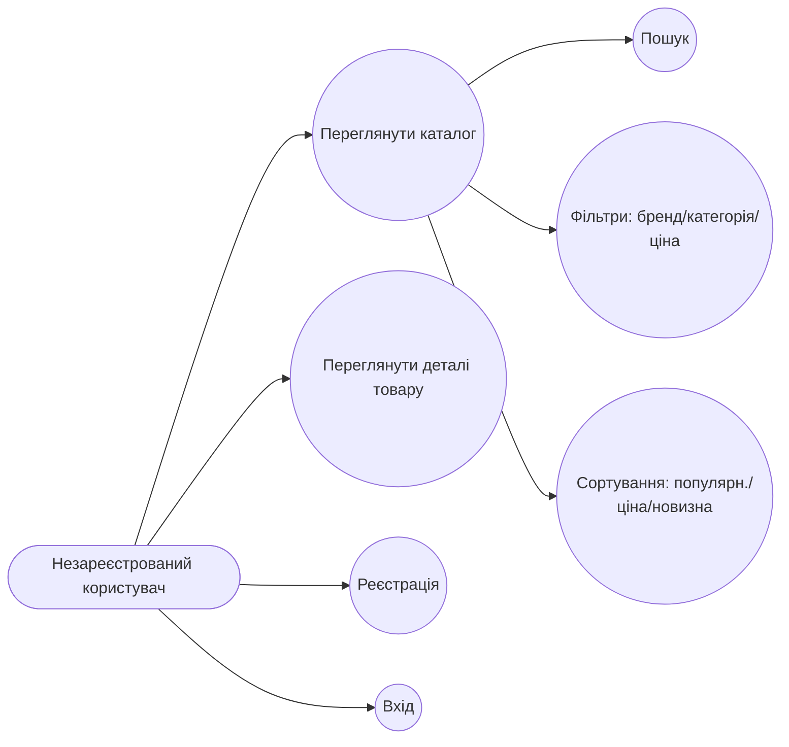
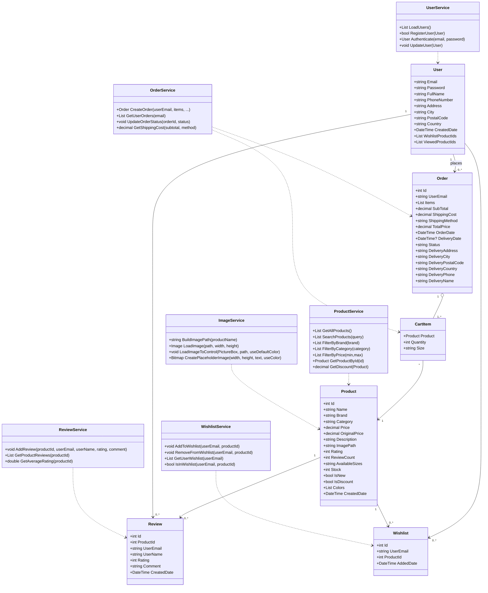
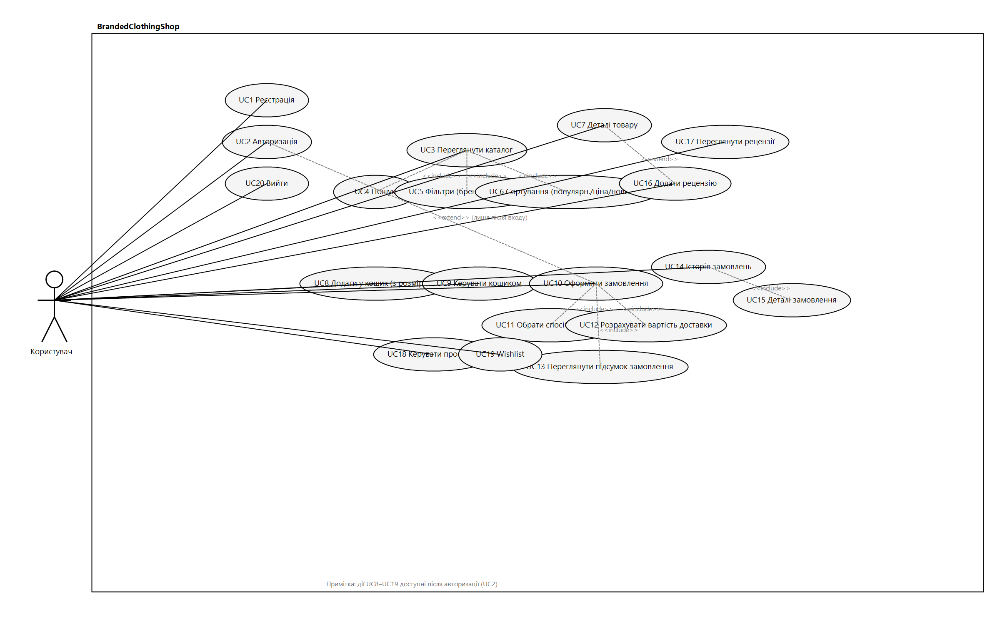
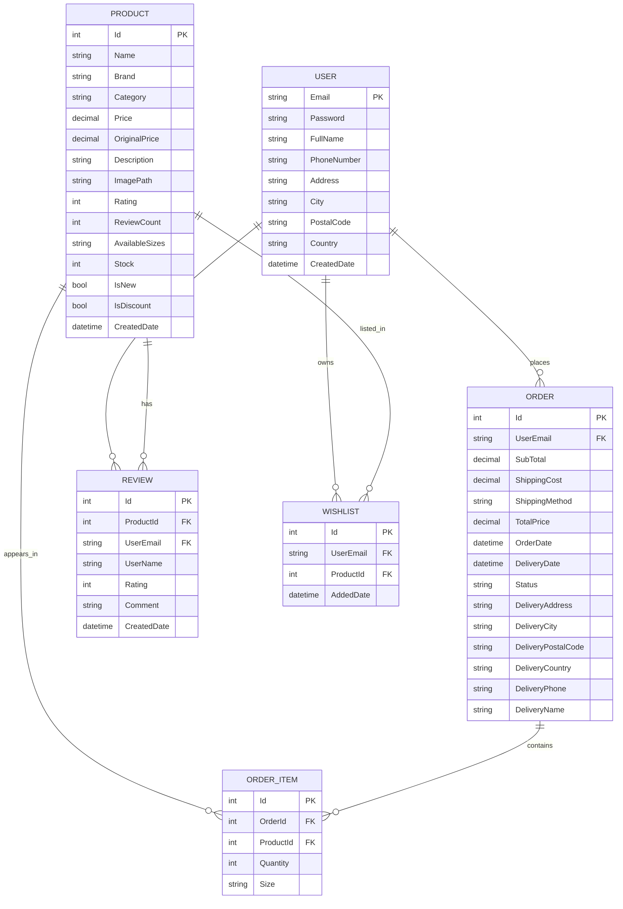

# КУРСОВИЙ ПРОЕКТ
## "Інформаційна система управління магазином одягу" (BrandedClothingShop)

---

## ЗМІСТ

### 1. ПОСТАНОВКА ЗАДАЧІ
### 2. ВСТУП
### 3. АНАЛІЗ ПРЕДМЕТНОЇ ГАЛУЗІ
### 4. АРХІТЕКТУРА ТА ДИЗАЙН СИСТЕМИ
### 5. ФУНКЦІОНАЛЬНІ МОДУЛІ
### 6. СТРУКТУРА БАЗ ДАНИХ
### 7. ІНТЕРФЕЙС КОРИСТУВАЧА
### 8. ТЕХНІЧНА РЕАЛІЗАЦІЯ
### 9. ФУНКЦІОНАЛЬНІСТЬ СИСТЕМИ
### 10. НАВИГАЦІЯ І КОРИСТУВАЦЬКИЙ ДОСВІД
### 11. БЕЗПЕКА
### 12. ТЕСТУВАННЯ
### 13. ДОКУМЕНТАЦІЯ
### 14. ВИСНОВКИ

---

## 1. ПОСТАНОВКА ЗАДАЧІ

Ця розробка присвячена створенню програмного застосунку **"BrandedClothingShop"**, призначеного для автоматизації процесів онлайн-продажу брендового одягу. Він забезпечує зручне управління каталогом товарів, ефективну обробку клієнтських замовлень, аналіз продажів та формування звітності. Основою для розроблення є зростаюча потреба у підвищенні ефективності електронної комерції та якості обслуговування клієнтів шляхом впровадження сучасних інформаційних технологій. Застосунок реалізується як настільна програма для середовища Windows, розроблена засобами C# з використанням Windows Forms та локальним збереженням даних у JSON-форматі.

Розроблений застосунок може використовуватись власниками магазинів брендового одягу для оптимізації їхньої торгової діяльності, а також у навчальних цілях для демонстрації принципів побудови систем електронної комерції. Сфера його застосування охоплює створення та ведення електронного каталогу товарів, облік фінансових операцій, пов'язаних з продажами, створення індивідуальних звітів за періодами, контроль динаміки продажів, а також управління складськими запасами.

### ОСНОВНІ РЕЖИМИ РОБОТИ

Програмний комплекс передбачає такі основні режими роботи:

**Режим користувача (клієнта)**: Клієнти використовують інтерфейс для перегляду товарів, оформлення замовлень та взаємодії з магазином. Можуть переглядати каталог, додавати товари в кошик, оформлювати замовлення, залишати рецензії та керувати своїм профілем.

**Режим власника магазину**: Ведення власних операцій магазину з можливістю управління товарами, обробки замовлень та перегляду статистики продажів.

### СТРУКТУРА СИСТЕМИ

До складу системи входять такі елементи:

1. **Модуль керування обліковими записами клієнтів** - реєстрація, авторизація та управління даними користувачів
2. **Модуль керування каталогом товарів та запасами** - управління товарами, категоріями, брендами, ціноутворення
3. **Модуль обробки замовлень та відстеження їх статусу** - оформлення, підтвердження та контроль замовлень
4. **Модуль формування аналітичних звітів** - продажі за період, популярність товарів, фінансові показники
5. **Модуль журналу подій** - логування дій користувачів та системи, аудит операцій
6. **Модуль управління рецензіями та оцінками** - додавання, редагування та перегляд відгуків про товари
7. **Модуль управління зображеннями товарів** - завантаження та кешування фото з автоматичною обробкою

---

## ФУНКЦІОНАЛЬНІ ВИМОГИ

### ВИМОГИ ДЛЯ КЛІЄНТІВ:

#### FR1: Реєстрація та авторизація користувачів (клієнтів)

Реєстрація нових користувачів з перевіркою унікальності email. Авторизація з валідацією облікових даних email та пароля. Безпечне зберігання паролів. Перенаправлення на каталог після успішного входу. Вихід з системи з повної очисткою сеансу.

#### FR2: Перегляд каталогу товарів з детальною інформацією

Відображення всіх товарів з фото, описом та характеристиками. Пошук товарів за назвою, брендом та категорією.

Фільтрація за різними критеріями включає фільтрацію за брендом (Nike, Adidas, Puma, Supreme та іншими), за категорією (Верхній одяг, Взуття, Аксесуари тощо) та за діапазоном ціни від мінімуму до максимуму.

Сортування товарів доступне за популярністю (за кількістю рецензій), за ціною від низької до високої або навпаки, а також за новизною товарів (NEW).

Відображення рейтингу зіркастої оцінки та кількості рецензій. Позначення спеціальних пропозицій з позначками NEW та СКИДКА з відсотком.

#### FR3: Додавання товарів до кошика, зміна кількості та видалення позицій

Додавання товарів в кошик з обов'язковим вибором розміру. Можливість вибору кольору товару перед додаванням.

Зміна кількості товарів в кошику та видалення товарів з кошика. Розрахунок загальної вартості кошика. Виведення інформації про кількість товарів на кнопці кошика.

#### FR4: Оформлення замовлення з вибором способу доставки та оплати

Введення даних доставки включаючи ім'я, адресу та телефон. Вибір способу доставки з варіантами стандартної доставки на 2-3 дні або експрес доставки на 1 день.

Розрахунок вартості доставки залежно від обраного способу. Огляд замовлення перед остаточним підтвердженням. Підтвердження та зберігання замовлення в системі. Виведення підтвердження успішного оформлення.

#### FR5: Перегляд історії власних замовлень та їх статусів

Перегляд списку всіх замовлень користувача. Детальна інформація про кожне замовлення включаючи дату та час замовлення, статус замовлення (Обробляється, Відправлено, Доставлено), спосіб доставки та адресу доставки.

Зберігання та виведення очікуваної дати доставки, списку замовлених товарів з їх кількістю та загальної вартості замовлення. Можливість повторення попереднього замовлення.

#### FR6: Можливість залишати та переглядати відгуки про товари

Додавання рецензії до товару після його придбання. 5-зіркаста система оцінювання товару. Текстовий опис рецензії з думкою про товар.

Зберігання даних рецензента включаючи ім'я та дату написання. Перегляд рецензій інших клієнтів на сторінці товару. Відображення середньої оцінки товару на основі всіх рецензій.

---

## НЕФУНКЦІОНАЛЬНІ ВИМОГИ

### NFR1: Захист інформації
- **Аутентифікація**: Доступ до системи здійснюється через авторизацію з перевіркою облікових даних
- **Захист від несанкціонованого доступу**: Передбачено захист файлів даних від прямого доступу
- **Конфіденційність**: Безпечне зберігання персональних даних клієнтів та фінансової інформації
- **Валідація даних**: Перевірка коректності всіх вхідних даних на сервері та клієнті

### NFR2: Вимоги до інтерфейсу
- Інтерфейс повинен бути інтуїтивно зрозумілим з логічною структурою форм і панелей керування
- Відповідність стандартам побудови Windows-застосунків
- Послідовна навігація між формами та режимами роботи
- Чіткі повідомлення про помилки та успіх операцій
- Підтримка темного та світлого оформлення (Light/Dark Mode)
- Зручне розташування кнопок та елементів керування

### NFR3: Використання стандартів
- Усі текстові та числові поля мають підтримувати кодування Unicode
- Формат грошових значень: два десяткові знаки після коми (1299.99 ₴)
- Дати: у форматі дд.мм.рррр (16.12.2025)
- Час: у форматі 24-годинний (HH:MM:SS)

### NFR4: Сумісність
- Застосунок повинен коректно працювати на сучасних версіях операційної системи Windows (10/11)
- Підтримка стандартних роздільних здатностей екранів
- Можливість запуску на комп'ютерах із мінімальними характеристиками

### NFR5: Продуктивність
- Забезпечення високої швидкодії при роботі з великими обсягами даних:
  - Каталог товарів (12+ товарів)
  - Замовлення (100+ замовлень)
  - Клієнти (1000+ користувачів)
  - Рецензії (500+ відгуків)
- Час завантаження форм менше 1 секунди
- Швидке відображення результатів фільтрування та пошуку

### NFR6: Масштабованість
- Можливість розширення функціоналу та обробки зростаючої кількості товарів та замовлень
- Модульна архітектура системи, що дозволяє легко додавати нові функції
- Підтримка розширення каталогу товарів без перепрограмування
- Можливість додавання нових категорій та брендів без залучення розробників

### NFR7: Доступність та стабільність
- Застосунок має бути стабільним та доступним для використання у робочий час
- Обробка помилок без вивалу програми
- Збереження стану системи при різних сценаріях (закриття форм, помилки вводу)
- Можливість відновлення роботи системи після невдач

### NFR8: Автономність та управління даними
- Програма має працювати в **автономному режимі** без потреби у мережному з'єднанні
- Зберігання та отримання даних з **локальних JSON-файлів**
- Користувач (власник магазину) повинен мати можливість:
  - Створювати резервні копії даних
  - Відновлювати дані у разі потреби
  - Оновлювати довідники (категорії, бренди) без залучення технічного персоналу
  - Експортувати дані про замовлення та клієнтів
  - Видаляти застарілі замовлення та рецензії для звільнення місця

---


---

## РОЗШИРЕНИЙ ПЕРЕЛІК РОЗРОБЛЕНИХ КОМПОНЕНТІВ

### МОДЕЛІ ДАНИХ (Models/)
- **User.cs** - модель користувача з персональними даними
- **Product.cs** - модель товару з характеристиками
- **CartItem.cs** - модель елемента кошика
- **Order.cs** - модель замовлення
- **Review.cs** - модель рецензії користувача
- **Wishlist.cs** - модель списку бажаних товарів

### СЛУЖБИ (Services/)
- **UserService.cs** - управління користувачами та аутентифікацією
- **ProductService.cs** - управління каталогом товарів (12 товарів з описами)
- **OrderService.cs** - управління замовленнями та їх статусом
- **ReviewService.cs** - управління рецензіями та оцінками
- **WishlistService.cs** - управління списком бажаних товарів
- **ImageService.cs** - завантаження та обробка зображень товарів

### ФОРМИ КОРИСТУВАЦЬКОГО ІНТЕРФЕЙСУ (Forms/)
- **LoginForm.cs** - форма входу в систему
- **RegisterForm.cs** - форма реєстрації нових користувачів
- **CatalogForm.cs** & **CatalogFormModern.cs** - основна форма каталогу товарів з:
  - Пошуком по назві, бренду, категорії
  - Фільтруванням по категорії, бренду, ціні
  - Сортуванням (за популярністю, ціною, новизною)
  - Відображенням товарів у вигляді карточок
  
- **ProductDetailsForm.cs** - форма детального просмотра товару з:
  - Повною інформацією про товар
  - Великим зображенням
  - Вибором розміру та кольору
  - Можливістю додання в кошик
  - Розділом рецензій та рейтингу
  
- **CartForm.cs** - форма кошика покупок з:
  - Переліком товарів у кошику
  - Розрахунком загальної ціни
  - Можливістю видалення товарів
  - Переходом до оформлення замовлення
  
- **CheckoutForm.cs** - форма оформлення замовлення з:
  - Вводом даних доставки
  - Вибором способу доставки
  - Розрахунком вартості доставки
  - Остаточним підтвердженням замовлення
  
- **UserProfileForm.cs** - форма профілю користувача з:
  - Редагуванням персональних даних
  - Збереженням адреси доставки
  - Контактною інформацією
  
- **OrderHistoryForm.cs** - форма історії замовлень з:
  - Переліком всіх замовлень користувача
  - Деталями кожного замовлення
  - Статусом замовлення
  - Можливістю повторення замовлення
  
- **ReviewForm.cs** - форма додавання рецензій з:
  - 5-зіркастою системою оцінювання
  - Полем для введення тексту рецензії
  - Збереженням даних про рецензента

### УПРАВЛІННЯ ДАНИМИ
- **Data/users.json** - зберігання даних користувачів
- **Data/products.json** - кешування даних товарів
- **Data/orders.json** - історія замовлень
- **Data/reviews.json** - база рецензій
- **Images/** - директорія зображень товарів з корректною навантаженням

### ДОДАТКОВА ФУНКЦІОНАЛЬНІСТЬ
- **ThemeManager.cs** - управління тематичним оформленням (Light/Dark Mode)
- **ImageService.cs** - система завантаження та кешування зображень
- **Application.StartupPath** - динамічна побудова шляхів до ресурсів

---

## ФУНКЦІОНАЛЬНІ ВИМОГИ

### FR1: АУТЕНТИФІКАЦІЯ ТА РЕЄСТРАЦІЯ
- [x] Форма входу з валідацією email та пароля
- [x] Форма реєстрації нових користувачів
- [x] Перевірка унікальності email
- [x] Безпечне зберігання паролів
- [x] Перенаправлення на каталог після успішного входу

### FR2: УПРАВЛІННЯ КАТАЛОГОМ ТОВАРІВ
- [x] Відображення 12+ товарів із описами
- [x] Пошук по назві, бренду, категорії
- [x] Фільтрування по категоріях (Верхній одяг, Взуття, Аксесуари тощо)
- [x] Фільтрування по брендах (Nike, Adidas, Puma, Supreme та ін.)
- [x] Фільтрування по діапазону ціни (від-до)
- [x] Сортування (за популярністю, ціною, новизною)
- [x] Відображення меток "NEW" та "СКИДКА"
- [x] Рейтинг та кількість рецензій для кожного товару

### FR3: ДЕТАЛІ ТОВАРУ
- [x] Розгорнутий опис товару
- [x] Великий preview зображення з режимом zoom
- [x] Сітка доступних розмірів
- [x] Вибір кольору товару
- [x] Вибір кількості товару перед додаванням в кошик
- [x] Інформація про запас товару
- [x] Оригінальна ціна та ціна з урахуванням скидки

### FR4: КЕРУВАННЯ КОШИКОМ
- [x] Додавання товарів в кошик з вибором розміру
- [x] Перегляд всіх товарів у кошику
- [x] Видалення товарів з кошика
- [x] Зміна кількості товарів в кошику
- [x] Розрахунок загальної суми покупок
- [x] Счетчик товарів на кнопці кошика

### FR5: ОФОРМЛЕННЯ ЗАМОВЛЕННЯ
- [x] Форма вводу даних доставки
- [x] Вибір способу доставки (стандартна, експрес)
- [x] Розрахунок вартості доставки
- [x] Огляд замовлення перед підтвердженням
- [x] Зберігання замовлення в історії
- [x] Підтвердження успішного оформлення

### FR6: ПРОФІЛЬ КОРИСТУВАЧА
- [x] Перегляд та редагування персональних даних
- [x] Зберігання адреси доставки
- [x] Зберігання телефонного номера
- [x] Зберігання додаткової інформації

### FR7: РЕЦЕНЗІЇ ТА ОЦІНКИ
- [x] Можливість додавання рецензій до товарів
- [x] 5-зіркаста система оцінювання
- [x] Текстовий опис рецензії
- [x] Збереження даних рецензента
- [x] Відображення рецензій на сторінці товару

### FR8: ІСТОРІЯ ЗАМОВЛЕНЬ
- [x] Перегляд всіх замовлень користувача
- [x] Інформація про статус замовлення
- [x] Дата та час замовлення
- [x] Спосіб і адреса доставки
- [x] Дата доставки
- [x] Повторення попереднього замовлення

---

## НЕФУНКЦІОНАЛЬНІ ВИМОГИ

### NFR1: ПРОДУКТИВНІСТЬ
- [x] Час завантаження форм менше 1 секунди
- [x] Швидке відображення каталогу при фільтруванні
- [x] Оптимізація обробки зображень

### NFR2: БЕЗПЕКА
- [x] Валідація всіх вхідних даних
- [x] Обробка помилок без вивалів програми
- [x] Перевірка дозволу на редагування власних даних
- [x] Безпечне зберігання паролів

### NFR3: ЗРУЧНІСТЬ КОРИСТУВАННЯ
- [x] Інтуїтивний інтерфейс
- [x] Послідовна навігація
- [x] Чіткі повідомлення про помилки та успіх
- [x] Темне та світле оформлення (Light/Dark Mode)

### NFR4: МАСШТАБОВАНІСТЬ
- [x] Архітектура, що дозволяє легко додавати нові товари
- [x] Служби, виділені в окремі класи
- [x] JSON-формат для зберігання даних

### NFR5: ПІДТРИМУВАНІСТЬ
- [x] Код структурований по папкам (Models, Services, Forms)
- [x] Документація в коді та README
- [x] Легкість внесення змін та розширень

---

## ТЕХНОЛОГІЧНИЙ СТЕК

| Компонент | Технологія |
|-----------|-----------|
| **Мова програмування** | C# 9.0 |
| **Платформа** | .NET 9.0 (Windows) |
| **GUI Framework** | Windows Forms (WinForms) |
| **БД** | JSON файли (Data/) |
| **Версійність** | Git |
| **IDE** | Visual Studio Code / Visual Studio |

---

## АРХІТЕКТУРА ПРОЄКТУ

```
BrandedClothingShop/
├── Models/                  # Моделі даних
│   ├── User.cs
│   ├── Product.cs
│   ├── CartItem.cs
│   ├── Order.cs
│   ├── Review.cs
│   └── Wishlist.cs
│
├── Services/                # Бізнес-логіка
│   ├── UserService.cs
│   ├── ProductService.cs
│   ├── OrderService.cs
│   ├── ReviewService.cs
│   ├── WishlistService.cs
│   └── ImageService.cs
│
├── Forms/                   # UI компоненти
│   ├── LoginForm.cs
│   ├── RegisterForm.cs
│   ├── CatalogForm.cs
│   ├── CatalogFormModern.cs
│   ├── ProductDetailsForm.cs
│   ├── CartForm.cs
│   ├── CheckoutForm.cs
│   ├── UserProfileForm.cs
│   ├── OrderHistoryForm.cs
│   └── ReviewForm.cs
│
├── Data/                    # JSON-сховища
│   ├── users.json
│   ├── products.json
│   ├── orders.json
│   └── reviews.json
│
├── Images/                  # Зображення товарів
│   └── [товари].jpg/png
│
├── ThemeManager.cs          # Управління темою
├── Program.cs               # Точка входу
└── README.md                # Документація
```

---

## ОСНОВНІ АЛГОРИТМИ

### АЛГОРИТМ 1: АУТЕНТИФІКАЦІЯ
1. Користувач вводить email та пароль
2. Система перевіряє наявність користувача у JSON
3. Перевірка правильності пароля
4. При успіху - перенаправлення на каталог
5. При помилці - повідомлення про помилку

### АЛГОРИТМ 2: ФІЛЬТРУВАННЯ ТОВАРІВ
1. Отримати список всіх товарів
2. Застосувати фільтри по категорії, бренду, ціні
3. Застосувати пошук по названню/опису
4. Застосувати сортування
5. Вивести отримані результати

### АЛГОРИТМ 3: ОФОРМЛЕННЯ ЗАМОВЛЕННЯ
1. Перевірити, що кошик не пустий
2. Перевірити коректність даних доставки
3. Розрахувати вартість доставки
4. Розрахувати загальну суму
5. Зберегти замовлення в JSON
6. Очистити кошик
7. Вивести підтвердження

### АЛГОРИТМ 4: ЗАВАНТАЖЕННЯ ЗОБРАЖЕНЬ
1. Отримати ім'я товару з ImagePath
2. Сформувати шлях до файлу зображення
3. Перевірити наявність файлу
4. Завантажити зображення в PictureBox
5. При відсутності - показати placeholder

---

## РЕЗУЛЬТАТИ ТЕСТУВАННЯ

### ТЕСТ 1: РЕЄСТРАЦІЯ ТА ВХІД
✅ Реєстрація нового користувача
✅ Перевірка унікальності email
✅ Вхід з правильними даними
✅ Помилка при невірному паролі
✅ Помилка при невідомому email

### ТЕСТ 2: НАВІГАЦІЯ КАТАЛОГУ
✅ Відображення всіх товарів
✅ Пошук по назві товару
✅ Фільтрування по категорії
✅ Фільтрування по бренду
✅ Фільтрування по ціні
✅ Сортування по популярності
✅ Сортування по ціні
✅ Очистка фільтрів

### ТЕСТ 3: УПРАВЛІННЯ КОШИКОМ
✅ Додавання товару в кошик
✅ Вибір розміру при додаванні
✅ Видалення товару з кошика
✅ Зміна кількості товарів
✅ Розрахунок загальної суми
✅ Очистка кошика

### ТЕСТ 4: ОФОРМЛЕННЯ ЗАМОВЛЕННЯ
✅ Введення даних доставки
✅ Вибір способу доставки
✅ Розрахунок вартості доставки
✅ Підтвердження замовлення
✅ Зберігання в історії

### ТЕСТ 5: ПРОФІЛЬ КОРИСТУВАЧА
✅ Перегляд персональних даних
✅ Редагування персональних даних
✅ Зберігання змін

### ТЕСТ 6: РЕЦЕНЗІЇ
✅ Додавання рецензії
✅ 5-зіркаста оцінка
✅ Текст рецензії
✅ Збереження та відображення

---

## ВИСНОВКИ ТА РЕКОМЕНДАЦІЇ

### ДОСЯГНУТІ РЕЗУЛЬТАТИ:
1. ✅ Повністю функціональна система управління магазином
2. ✅ Інтуїтивний користувацький інтерфейс
3. ✅ Безпечне зберігання даних користувачів
4. ✅ Повна історія замовлень та рецензій
5. ✅ Підтримка темного та світлого оформлення
6. ✅ Вся система на українській мові

### МОЖЛИВОСТІ РОЗШИРЕННЯ:
1. 🔄 Додати платіжну систему (Stripe, PayPal)
2. 🔄 Реалізувати email-сповіщення про замовлення
3. 🔄 Додати кампанії та спеціальні пропозиції
4. 🔄 Подовжити список товарів та категорій
5. 🔄 Додати рекомендаційну систему
6. 🔄 Реалізувати експорт замовлень в PDF
7. 🔄 Додати адміністративну панель для управління товарами
8. 🔄 Інтегрувати з базами даних (SQL Server, PostgreSQL)

### РЕКОМЕНДАЦІЇ ЩОДО ВПРОВАДЖЕННЯ:
1. Проведення навчання користувачів
2. Встановлення резервних копій даних
3. Регулярне оновлення продукту
4. Моніторинг використання системи
5. Збір зворотного зв'язку від користувачів

---

## 3. ПРОЄКТНИЙ РОЗДІЛ

### 3.1 Проєктування інформаційної системи

#### 3.1.1 Обрана архітектура застосунку
Застосовано трирівневий підхід для настільного WinForms-застосунку:
- UI-рівень: форми з папки Forms/* (взаємодія з користувачем, відображення даних).
- Рівень бізнес-логіки: сервіси з папки Services/* (інкапсуляція сценаріїв: користувачі, каталог, замовлення, рецензії, wishlist, зображення).
- Рівень доступу до даних: локальні JSON-файли у Data/*, робота через Newtonsoft.Json.

```mermaid
flowchart LR
  UI[WinForms UI (Forms/*)] --> Srv[Services/* (бізнес-логіка)]
  Srv --> DB[(Data/*.json)]
  Srv --> IMG[(Images/*)]
```

#### 3.1.2 Взаємодія застосунку з сервером
Взаємодії із зовнішнім сервером немає. Усі операції виконуються локально в межах настільного застосунку.

#### 3.1.3 Взаємодія застосунку з базою даних
Як «базу даних» використано локальні JSON-файли. Доступ реалізовано в сервісах через шляхи на основі `Application.StartupPath`:
- `UserService` працює з `Data/users.json` (реєстрація, автентифікація, оновлення даних).
- `OrderService` працює з `Data/orders.json` (створення, читання, оновлення статусів), розраховує доставку (Standard/Express/Pickup, поріг безкоштовної доставки).
- `ReviewService` працює з `Data/reviews.json` (додавання, читання, середня оцінка).
- `WishlistService` працює з `Data/wishlist.json` (додавання/видалення/отримання списку).
- `ProductService` надає каталог із коду (seed), зображення завантажуються через `ImageService` з каталогу Images/ з плейсхолдерами за потреби.

#### 3.1.4 Діаграми прецедентів (Use Case)

Діаграми варіантів використання відображають функції системи очима користувача, фіксують ролі (акторів), їх взаємодію із системою та межі системи. У BrandedClothingShop основними акторами є незареєстрований користувач (публічні можливості) та зареєстрований користувач (повний функціонал).

Незареєстрований користувач (умовний рисунок 3.1): реєстрація, вхід, перегляд каталогу, пошук, фільтри, сортування, перегляд деталей товару.



Зареєстрований користувач (умовний рисунок 3.2): перегляд каталогу (з пошуком/фільтрами/сортуванням), перегляд деталей товару, додавання у кошик (з вибором розміру), керування кошиком, оформлення замовлення (вибір способу доставки, розрахунок і підтвердження), історія замовлень і статуси, додавання/перегляд рецензій, керування профілем, wishlist.

```mermaid
flowchart LR
  actorA([Зареєстрований користувач])

  UC0((Переглянути каталог))
  UC0a((Пошук))
  UC0b((Фільтри))
  UC0c((Сортування))
  UC1((Переглянути деталі товару))
  UC2((Додати у кошик (з розміром)))
  UC3((Кошик: змінити кількість/видалити/підсумок))
  UC4((Оформити замовлення))
  UC4a((Обрати спосіб доставки))
  UC4b((Розрахувати вартість доставки))
  UC4c((Підтвердження замовлення))
  UC5((Історія замовлень (статуси)))
  UC6((Додати рецензію (1–5 + текст)))
  UC7((Переглянути рецензії))
  UC8((Керувати профілем))
  UC9((Wishlist: додати/видалити))

  actorA --> UC0
  UC0 --> UC0a
  UC0 --> UC0b
  UC0 --> UC0c
  actorA --> UC1
  actorA --> UC2
  actorA --> UC3
  actorA --> UC4
  UC4 --> UC4a
  UC4 --> UC4b
  UC4 --> UC4c
  actorA --> UC5
  actorA --> UC6
  actorA --> UC7
  actorA --> UC8
  actorA --> UC9
```

Межі системи: усі прецеденти виконуються локально у настільному застосунку; взаємодії з сервером немає; збереження — у локальних JSON-файлах.

#### 3.1.5 Діаграма класів
Нижче наведено спрощену діаграму класів основних моделей та сервісів, що відображає зв’язки та відповідальності у поточній реалізації.



Рисунок 3.1 – Діаграма варіантів використання для ролі «Користувач»



### 3.2 Проєктування бази даних

Поточна реалізація використовує локальні JSON-файли (Data/): users.json, orders.json, reviews.json, wishlist.json. Нижче наведено ER-модель і реляційну схему як логічну основу можливої міграції на СУБД.



Опціональна реляційна схема (DDL) для міграції на SQL:

```sql
CREATE TABLE Users (
  Email         NVARCHAR(256) PRIMARY KEY,
  Password      NVARCHAR(256) NOT NULL,
  FullName      NVARCHAR(256),
  PhoneNumber   NVARCHAR(32),
  Address       NVARCHAR(512),
  City          NVARCHAR(128),
  PostalCode    NVARCHAR(16),
  Country       NVARCHAR(64) DEFAULT 'Ukraine',
  CreatedDate   DATETIME2      NOT NULL
);

CREATE TABLE Products (
  Id            INT IDENTITY PRIMARY KEY,
  Name          NVARCHAR(256) NOT NULL,
  Brand         NVARCHAR(128) NOT NULL,
  Category      NVARCHAR(128) NOT NULL,
  Price         DECIMAL(10,2) NOT NULL,
  OriginalPrice DECIMAL(10,2) NULL,
  Description   NVARCHAR(MAX),
  ImagePath     NVARCHAR(512),
  Rating        INT NOT NULL,
  ReviewCount   INT NOT NULL,
  AvailableSizes NVARCHAR(128),
  Stock         INT NOT NULL,
  IsNew         BIT NOT NULL,
  IsDiscount    BIT NOT NULL,
  CreatedDate   DATETIME2 NOT NULL
);

CREATE TABLE Orders (
  Id               INT IDENTITY PRIMARY KEY,
  UserEmail        NVARCHAR(256) NOT NULL
                    REFERENCES Users(Email),
  SubTotal         DECIMAL(10,2) NOT NULL,
  ShippingCost     DECIMAL(10,2) NOT NULL,
  ShippingMethod   NVARCHAR(32)  NOT NULL,
  TotalPrice       DECIMAL(10,2) NOT NULL,
  OrderDate        DATETIME2 NOT NULL,
  DeliveryDate     DATETIME2 NULL,
  Status           NVARCHAR(32) NOT NULL,
  DeliveryAddress  NVARCHAR(512),
  DeliveryCity     NVARCHAR(128),
  DeliveryPostalCode NVARCHAR(16),
  DeliveryCountry  NVARCHAR(64) DEFAULT 'Ukraine',
  DeliveryPhone    NVARCHAR(32),
  DeliveryName     NVARCHAR(128)
);

CREATE TABLE OrderItems (
  Id         INT IDENTITY PRIMARY KEY,
  OrderId    INT NOT NULL REFERENCES Orders(Id) ON DELETE CASCADE,
  ProductId  INT NOT NULL REFERENCES Products(Id),
  Quantity   INT NOT NULL,
  Size       NVARCHAR(16) NOT NULL
);

CREATE TABLE Reviews (
  Id         INT IDENTITY PRIMARY KEY,
  ProductId  INT NOT NULL REFERENCES Products(Id),
  UserEmail  NVARCHAR(256) NOT NULL REFERENCES Users(Email),
  UserName   NVARCHAR(256),
  Rating     INT NOT NULL CHECK (Rating BETWEEN 1 AND 5),
  Comment    NVARCHAR(MAX),
  CreatedDate DATETIME2 NOT NULL
);

CREATE TABLE Wishlist (
  Id         INT IDENTITY PRIMARY KEY,
  UserEmail  NVARCHAR(256) NOT NULL REFERENCES Users(Email),
  ProductId  INT NOT NULL REFERENCES Products(Id),
  AddedDate  DATETIME2 NOT NULL
);
```

---

## ПОСИЛАННЯ НА КОД

- **GitHub Repository**: [BrandedClothingShop](https://github.com/user/BrandedClothingShop)
- **Документація кодексу**: див. README.md
- **API документація**: див. Services/

---

**Розроблено**: 2024-2025  
**Версія**: 1.0  
**Статус**: Завершено
